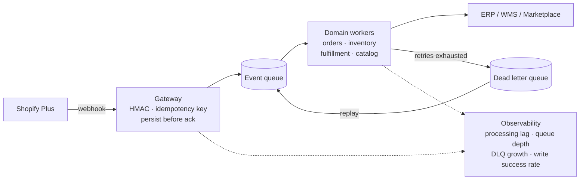

# Leonardo Pedani

**Shopify Plus Architect & Integration Engineer** — building scalable integration and middleware systems for enterprise ecommerce.

[codepunklab.com](https://codepunklab.com) · [LinkedIn](https://www.linkedin.com/in/leonardo-cassai-pedani/) · info@codepunklab.com

---

## What I build

The middleware between Shopify Plus and the systems a merchant already runs: ERPs, warehouses, marketplaces, invoicing platforms, 3PLs.

The hard part is rarely the API call. It is that Shopify and an ERP are two sources of truth with no shared transaction boundary. Webhooks arrive at least once, sometimes out of order. The Admin API throttles on a cost budget, not a request count. And an ERP in a maintenance window looks exactly like an ERP that is merely slow — until you decide which one to assume. Everything below is designed around those three facts.

`Python` · `FastAPI` · `Node.js` · `PostgreSQL` · `Redis` · `Shopify Admin GraphQL & REST` · `Shopify Functions` · `Cloudflare Workers`

---

## Reference architectures

Public and MIT-licensed. They are written to be read and adapted, not installed: documentation first, with runnable examples where the code is the clearest way to state the point.

### [shopify-integration-architecture](https://github.com/LeoCodeIt/shopify-integration-architecture)

How a Shopify Plus integration platform is put together end to end — the gateway, the queue, the domain workers, the adapter layer, and the instrumentation that tells you it is still working.

What's inside

- **Webhook gateway** — HMAC verification, idempotency on `X-Shopify-Webhook-Id`, persistence *before* acknowledgement, immediate 2xx
- **Queue and domain workers** — orders, inventory, fulfillment and catalog as separate consumers rather than one handler
- **Rate limits as an architectural constraint** — REST at 2/20 req/s and GraphQL at 100/1000 cost points/s are different problems, not the same one
- **Observability** — structured logs, Prometheus metrics, OpenTelemetry traces, and which signals are worth an alert
- Reference implementation with `docker-compose`, `.env.example`, and diagrams

### [shopify-webhook-reliability](https://github.com/LeoCodeIt/shopify-webhook-reliability)

What happens to a webhook handler after the happy path ends: duplicate deliveries, slow downstreams, restarts mid-processing, and events that will never succeed.

What's inside

- **The delivery model** — why Shopify webhooks must be treated as at-least-once, and what silently corrupts when they are not
- **Idempotency** — two working implementations, Redis and PostgreSQL, with the edge cases each one leaves open
- **Retry strategy** — backoff schedules, and the difference between a failure worth retrying and one that never will be
- **Dead letter queues and replay** — how events leave the pipeline and how they come back into it
- Seven documents, four diagrams, five runnable examples

---

## From codepunklab.com

Case studies and architecture patterns from real projects, anonymised. This list is regenerated weekly from the site.

<!-- latest:start -->
- **[Italian Electronic Invoice Data Collection at Checkout for a Shopify Plus Wine Retailer](https://codepunklab.com/case-studies/italian-electronic-invoice-checkout/)** · Case study · 2026-08-13
- **[Fixing a Default Shipping Method with a Delivery Customization Function and a Checkout UI Extension](https://codepunklab.com/case-studies/delivery-method-default-fix-checkout-extension/)** · Case study · 2026-08-13
- **[Tiered Volume Discounts via Shopify Functions for a Shopify Plus Wine Retailer](https://codepunklab.com/case-studies/tiered-volume-discounts-shopify-functions/)** · Case study · 2026-08-13
- **[Coordinating Shopify Functions and Checkout UI Extensions via Cart Attributes](https://codepunklab.com/patterns/function-checkout-extension-cart-attribute-coordination/)** · Pattern · 2026-08-13
- **[Multi-Market Catalog Search Migration for a High-SKU Shopify Plus Wine Retailer](https://codepunklab.com/case-studies/multi-market-catalog-search-migration/)** · Case study · 2026-08-13
<!-- latest:end -->

---

## Contact

Available for Shopify Plus integration architecture work — audits, middleware design, ERP and marketplace connectors.

**[codepunklab.com](https://codepunklab.com)** · [versione italiana](https://codepunklab.com/it/) · [LinkedIn](https://www.linkedin.com/in/leonardo-cassai-pedani/) · info@codepunklab.com
